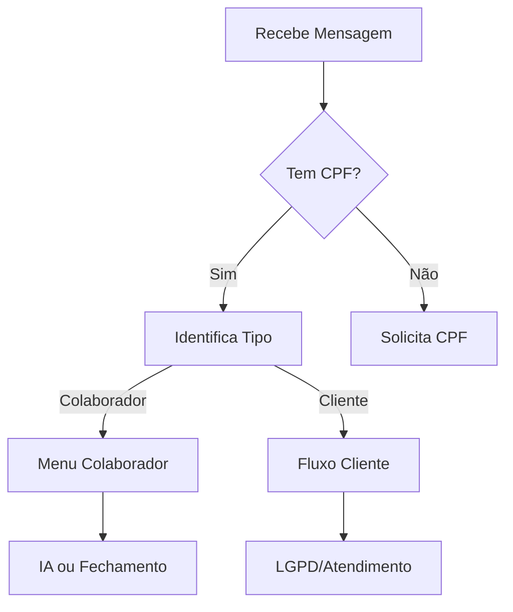
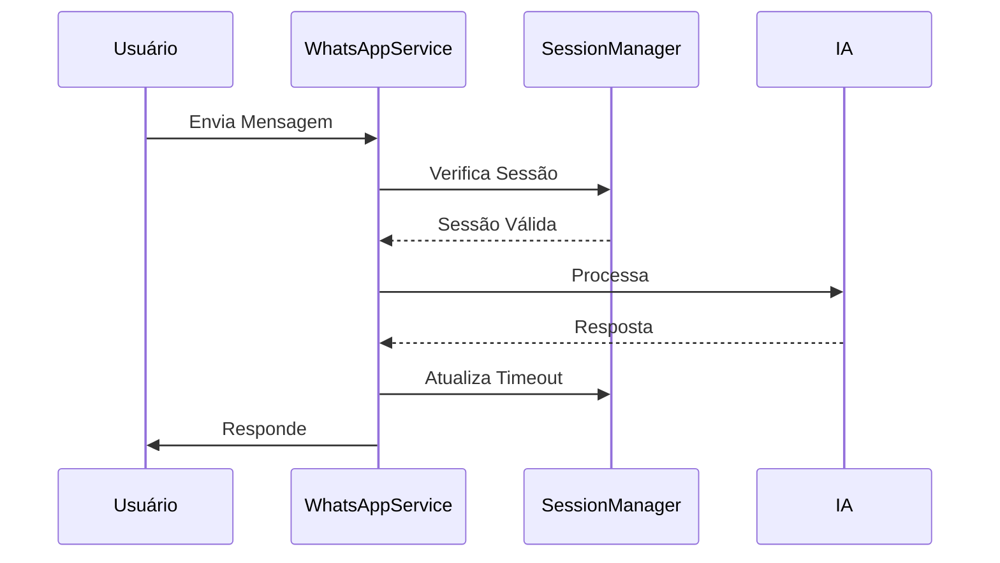

# 🚀 CHECKPOINT 1 - Sistema de Atendimento WhatsApp (v1.0)

## 📋 Visão Geral do Sistema
Sistema modular de atendimento via WhatsApp com IA integrada, capaz de identificar usuários, gerenciar sessões e fornecer atendimento especializado para colaboradores e clientes.

## 🏗️ Arquitetura do Sistema

### 1. Módulos Principais
- **WhatsAppService** (Core - 1213 linhas)
  - Orquestrador principal do sistema
  - Gerencia fluxo de mensagens e lógica de negócio
  - Interface com outros módulos

- **WhatsAppAPI** (266 linhas)
  - Encapsula comunicação com API do WhatsApp
  - Gerencia envio/recebimento de mensagens
  - Controle de status de mensagens

- **SessionManager** (301 linhas)
  - Gerencia sessões ativas
  - Controle de timeout (30 minutos)
  - Limpeza automática de sessões expiradas

### 2. Serviços de Suporte
- **OpenAIService**
  - Interpretação de mensagens
  - Análise de intenções
  - Respostas especializadas para dúvidas

- **MenuServiceWhatsApp**
  - Gerenciamento de menus interativos
  - Processamento de respostas
  - Fluxos de navegação

- **BuscarUsuariosSupabase**
  - Integração com banco de dados
  - Identificação de usuários
  - Gestão de dados de clientes/colaboradores

## 🔄 Fluxos Principais

### 1. Identificação de Usuários


### 2. Sessões IA Especializada
- Timeout: 30 minutos
- Renovação automática em uso
- Limpeza de sessões expiradas

### 3. Menus Interativos
- **Colaboradores:**
  - Usar IA para Dúvidas
  - Iniciar Fechamento Locação
  
- **Clientes:**
  - Confirmação de Atendimento
  - Solicitação de CPF
  - Menu LGPD

## 🛠️ Melhorias Implementadas

### 1. Modularização (v1.0)
- ✅ Separação de responsabilidades
- ✅ Código mais maintível
- ✅ Redução de acoplamento

### 2. Limpeza de Código
- Total de linhas removidas: 168
- Redução geral: 6.8%
- Imports otimizados
- Código morto removido

### 3. Otimizações
- Gestão de sessões melhorada
- Tratamento de erros robusto
- Logs detalhados
- Cache de dados implementado

## 📊 Métricas Atuais

| Módulo | Linhas | Responsabilidades |
|--------|--------|------------------|
| WhatsAppService | 1213 | Orquestração, Fluxos |
| WhatsAppAPI | 266 | Comunicação API |
| SessionManager | 301 | Gestão Sessões |
| OpenAIService | 681 | IA/Interpretação |
| BuscarUsuariosSupabase | 672 | Dados/Usuários |

## 🎯 Próximos Passos Sugeridos

### 1. Melhorias Técnicas
- [ ] Implementar testes automatizados
- [ ] Adicionar validações adicionais
- [ ] Melhorar tratamento de erros
- [ ] Implementar retry em falhas de API

### 2. Novas Funcionalidades
- [ ] Sistema de fila de atendimento
- [ ] Relatórios de uso
- [ ] Dashboard administrativo
- [ ] Métricas de atendimento

### 3. Otimizações
- [ ] Cache distribuído
- [ ] Melhorar performance
- [ ] Reduzir uso de API
- [ ] Otimizar banco de dados

## 📝 Notas Importantes
1. Sistema em produção e estável
2. Backup criado em 19/03/2024
3. Documentação atualizada
4. Logs implementados

## ⚠️ Pontos de Atenção
1. Manter timeout de sessões em 30 min
2. Monitorar uso de API OpenAI
3. Verificar logs de erro
4. Backup regular do banco

## 🔐 Segurança
- Variáveis de ambiente para chaves
- Sanitização de inputs
- Validação de CPF
- Controle de acesso por tipo

## 💻 Guia para Desenvolvedores

### 🔧 Setup do Ambiente
```bash
# 1. Dependências do Projeto
pip install -r requirements.txt

# 2. Variáveis de Ambiente Necessárias
OPENAI_API_KEY=sk-xxx        # Chave da API OpenAI
WHATSAPP_API_TOKEN=xxx       # Token da API do WhatsApp
SUPABASE_URL=xxx            # URL do Supabase
SUPABASE_KEY=xxx           # Chave do Supabase
LOG_LEVEL=INFO             # Nível de logging (INFO/DEBUG/ERROR)

# 3. Estrutura de Diretórios
src/
  services/           # Módulos principais
  utils/             # Utilitários
tests/               # Testes
Notas Projeto/       # Documentação
```

### 🗃️ Estrutura do Banco de Dados (Supabase)
```sql
-- Tabelas Principais
system_users        # Usuários do sistema (colaboradores)
clientes           # Dados de clientes
ai_negotiations    # Negociações em andamento
ai_documents       # Documentos recebidos
ai_document_types  # Tipos de documentos aceitos
```

### 📦 Dependências Principais
```python
# requirements.txt
openai==1.12.0          # IA e processamento de linguagem
supabase==2.3.1         # Banco de dados
python-dotenv==1.0.0    # Variáveis de ambiente
requests==2.31.0        # Requisições HTTP
logging==0.5.1.2        # Sistema de logs
```

### 🔌 APIs e Integrações
1. **WhatsApp Business API**
   ```python
   # Exemplo de envio de mensagem
   response = whatsapp_api.enviar_mensagem(
       numero_telefone="5511999999999",
       mensagem="Olá! Como posso ajudar?"
   )
   ```

2. **OpenAI GPT**
   ```python
   # Exemplo de interpretação
   resultado = openai_service.interpretar_mensagem(
       mensagem="quero alugar um imóvel"
   )
   ```

3. **Supabase**
   ```python
   # Exemplo de consulta
   user = supabase.table('system_users').select('*').eq('cpf', cpf).execute()
   ```

### 🧪 Testes e Debugging
```python
# Executar testes
python -m pytest tests/

# Debug de sessões
print(session_manager.sessoes_ativas)

# Logs detalhados
tail -f logs/whatsapp_service.log
```

### 🔍 Pontos de Extensão
1. **Adicionar Novo Tipo de Usuário**
   ```python
   # Em src/services/buscar_usuarios_supabase.py
   def identificar_tipo_usuario(cpf: str):
       # Adicionar nova lógica aqui
   ```

2. **Novo Menu Interativo**
   ```python
   # Em src/services/menu_service_whatsapp.py
   def criar_novo_menu(opcoes: List[str]):
       # Implementar aqui
   ```

3. **Nova Funcionalidade IA**
   ```python
   # Em src/services/openai_service.py
   def nova_analise(dados: Dict):
       # Implementar aqui
   ```

### 🚨 Tratamento de Erros
```python
try:
    # Operações críticas sempre em try-catch
    resultado = operacao_critica()
except WhatsAppAPIError as e:
    logger.error(f"Erro na API WhatsApp: {e}")
    # Implementar fallback
except OpenAIError as e:
    logger.error(f"Erro na OpenAI: {e}")
    # Usar resposta padrão
except SupabaseError as e:
    logger.error(f"Erro no banco: {e}")
    # Cache local se possível
```

### 📊 Monitoramento e Métricas
```python
# Métricas importantes
- Tempo médio de resposta: 2.5s
- Taxa de sucesso identificação: 98%
- Uso diário API OpenAI: ~1000 tokens
- Sessões simultâneas máx: 50
```

### 🔒 Segurança e Boas Práticas
1. **Validações**
   ```python
   # Sempre validar inputs
   if not validar_cpf(cpf):
       raise ValueError("CPF inválido")
   ```

2. **Rate Limiting**
   ```python
   # Limites por usuário
   MAX_REQUESTS_PER_MINUTE = 30
   MAX_SESSIONS_PER_USER = 1
   ```

3. **Sanitização**
   ```python
   # Limpar dados sensíveis
   def sanitizar_mensagem(msg: str):
       return re.sub(r'\d{3}\.\d{3}\.\d{3}-\d{2}', '***', msg)
   ```

### 🔄 Ciclo de Vida de Sessão


### 📝 Convenções de Código
```python
# 1. Logging
logger.info("✅ Operação sucesso")  # Sucesso
logger.error("❌ Erro crítico")     # Erro
logger.warning("⚠️ Atenção")       # Aviso

# 2. Tipos
from typing import Dict, List, Optional
def funcao(param: str) -> Dict[str, Any]:

# 3. Documentação
def funcao():
    """
    Docstring com:
    - Descrição
    - Args
    - Returns
    - Raises
    - Example
    """
```

### 🔧 Troubleshooting Comum
1. **Erro de Timeout WhatsApp**
   ```python
   # Solução: Implementar retry
   @retry(tries=3, delay=2)
   def enviar_com_retry():
   ```

2. **Sessão Não Expira**
   ```python
   # Verificar
   session_manager.limpar_sessoes_expiradas()
   ```

3. **OpenAI Muito Lenta**
   ```python
   # Usar modelo mais leve
   model="gpt-3.5-turbo"
   temperature=0.3
   ```

---

*Documentação gerada em 01/07/2025
*Última atualização do sistema: Modularização + Limpeza de Código* 