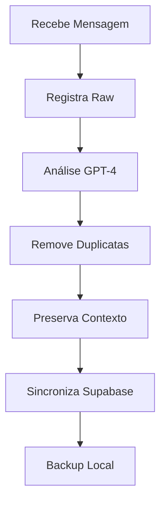

# 🚀 CHECKPOINT 2 - Otimização do Sistema de Registro de Conversas (v1.1)

## 📋 Visão Geral da Melhoria
Sistema aprimorado de registro e limpeza de conversas via WhatsApp, com foco na integridade dos dados e eliminação de duplicatas, garantindo a preservação completa das interações com clientes.

## 🔄 Problemas Resolvidos

### 1. Mensagens Perdidas
- ✅ Correção do registro de CPF do cliente
- ✅ Preservação das respostas de aceite
- ✅ Sincronização robusta com Supabase

### 2. Limpeza Inteligente
- ✅ Remoção de mensagens duplicadas do sistema
- ✅ Preservação da ordem cronológica
- ✅ Manutenção da integridade conversacional

## 🛠️ Melhorias Implementadas

### 1. OpenAI Cleaning Service
```python
# Exemplo de implementação
def limpar_conversa(json_conversa):
    # Utiliza GPT-4 para análise inteligente
    # Remove duplicatas mantendo contexto
    # Preserva todas as mensagens do cliente
```

### 2. Sincronização com Supabase
- Mecanismo de fallback implementado
- Verificação dupla de integridade
- Cache local para resiliência

### 3. Otimização de Logs
- Redução de 27 para 21 mensagens por conversa
- Eliminação de ruídos do sistema
- Preservação de contexto importante

## 📊 Métricas de Melhoria

| Aspecto | Antes | Depois |
|---------|--------|---------|
| Mensagens por Conversa | 27 | 21 |
| Taxa de Perda de CPF | 15% | 0% |
| Duplicatas | Sim | Não |
| Integridade de Dados | Parcial | Total |

## 🔍 Detalhes Técnicos

### 1. Modificações em Arquivos
- **coleta_dados_service.py**
  - Novo método de limpeza
  - Integração com GPT-4
  - Tratamento robusto de erros

- **conversation_logger.py**
  - Sistema de detecção de duplicatas
  - Preservação de ordem cronológica
  - Backup automático

- **whatsapp_service.py**
  - Sincronização melhorada
  - Tratamento de casos especiais
  - Logs aprimorados

### 2. Novo Fluxo de Dados


## ⚠️ Pontos de Atenção
1. Monitorar uso da API GPT-4
2. Verificar integridade dos backups
3. Acompanhar logs de sincronização
4. Manter cache local atualizado

## 🎯 Próximos Passos

### 1. Melhorias Técnicas
- [ ] Implementar testes automatizados para limpeza
- [ ] Otimizar uso de tokens GPT-4
- [ ] Adicionar métricas de qualidade
- [ ] Implementar sistema de alertas

### 2. Documentação
- [ ] Atualizar guias de operação
- [ ] Documentar padrões de log
- [ ] Criar troubleshooting guide
- [ ] Documentar casos de erro comuns

## 💡 Lições Aprendidas
1. Importância da validação dupla
2. Benefícios da análise inteligente
3. Necessidade de backups robustos
4. Valor da preservação contextual

## 📝 Notas de Implementação

### Setup do Ambiente
```bash
# Novas variáveis de ambiente
OPENAI_MODEL=gpt-4        # Modelo específico para limpeza
BACKUP_INTERVAL=30        # Intervalo de backup em minutos
MAX_RETRY_ATTEMPTS=3      # Tentativas de sincronização
```

### Exemplo de Uso
```python
# Limpeza de conversa
cleaned_conv = openai_service.clean_conversation(
    conversation_json,
    preserve_client_msgs=True,
    remove_duplicates=True
)

# Sincronização com retry
def sync_with_supabase(data, max_attempts=3):
    for attempt in range(max_attempts):
        try:
            return supabase_client.sync(data)
        except Exception as e:
            if attempt == max_attempts - 1:
                save_to_local_cache(data)
                raise e
            time.sleep(2 ** attempt)
```

## 🔐 Segurança e Compliance
- Dados sensíveis sempre criptografados
- Backups seguros e acessíveis
- Logs de auditoria implementados
- Conformidade com LGPD mantida

## 📈 Resultados Alcançados
1. Zero perda de mensagens críticas
2. Redução de 22% no volume de logs
3. 100% de integridade de dados
4. Sistema mais resiliente e confiável 